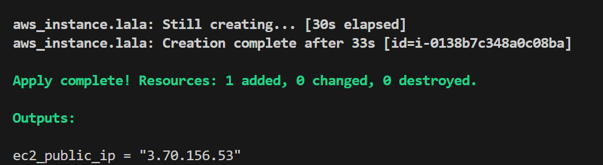
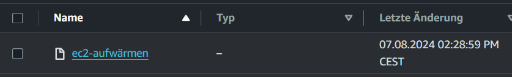
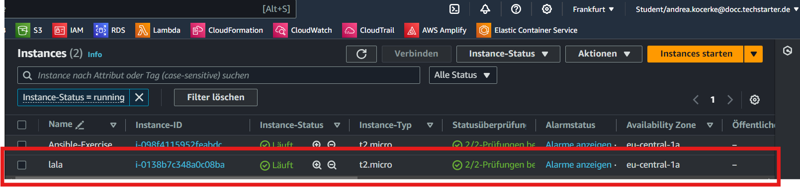
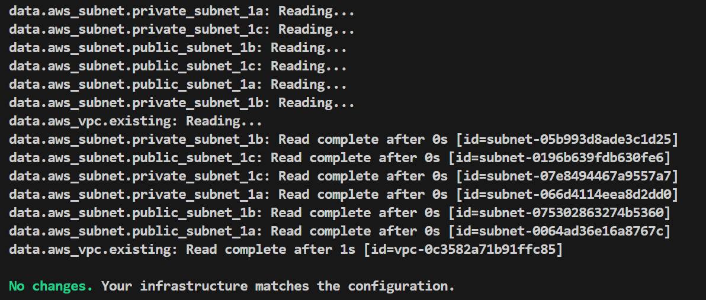
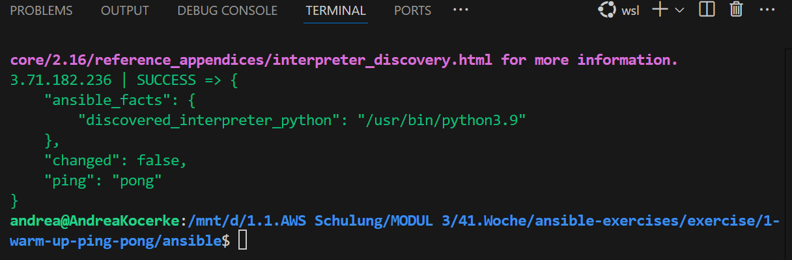
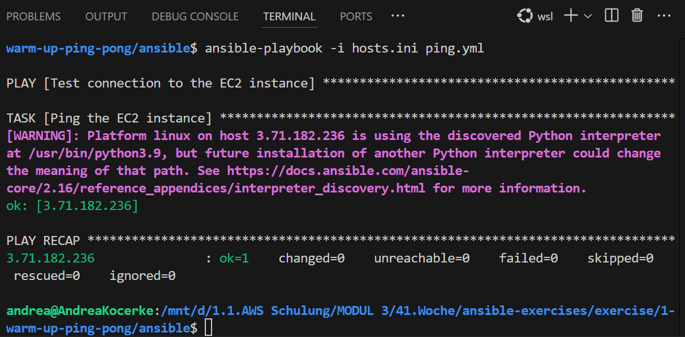

# Exercise 1 - Aufwärmen

## 1. Erstelle eine Infrastruktur mit 1x VPC und 1x EC2-Instanz

### CHECK ✅
#### EC2







#### VPC



## 2. Trage in die hosts.ini einen passenden Host ein. Ungefähr so:✅
```console
<host-name> ansible_host=<ip-adresse> ansible_user=ubuntu ansible_ssh_private_key_file=<path-to-key>
```

3. Pinge die Instanz an.
```console
ansible -i hosts.ini all -m ping
```
### CHECK ✅







4. ERFOLG!