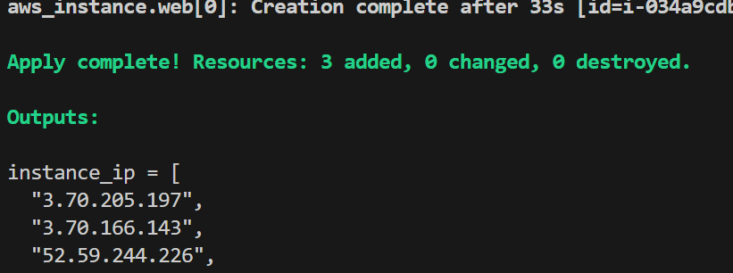
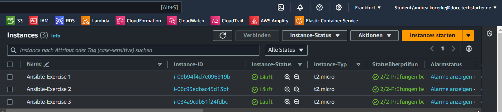
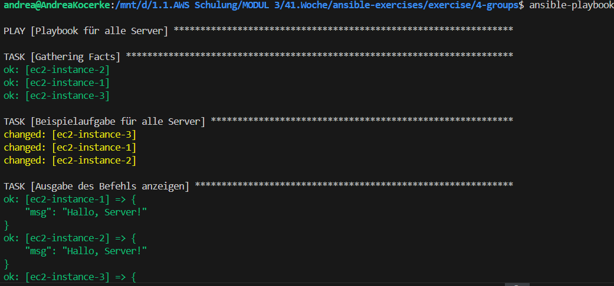
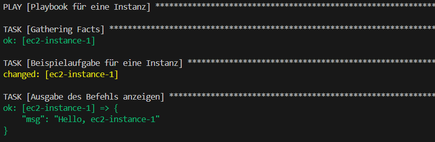
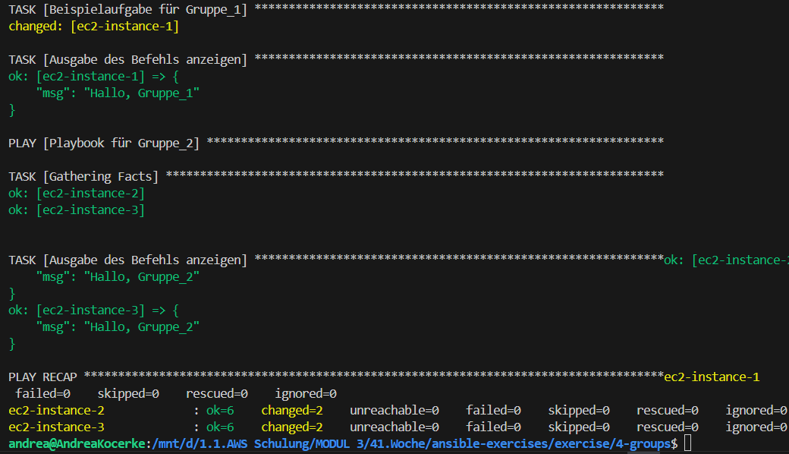
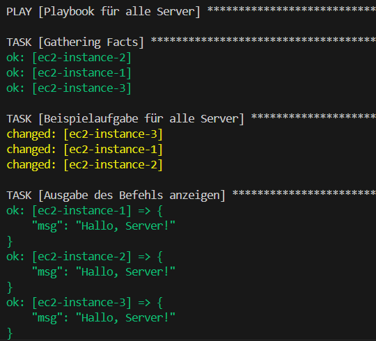
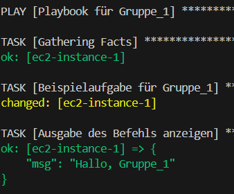
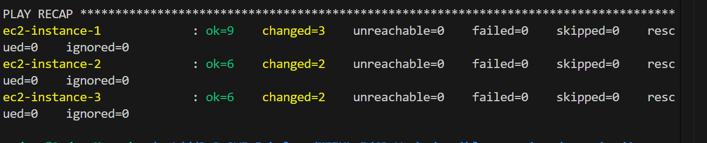

# Exercise 4 - Groups

1. Du benötigst eine Infrastruktur mit 1x VPC und 3x EC2-Instanzen

# CHECK✅

</img>

</img>

--- 

2. Erstelle eine Gruppe mit 1 Host, und eine Gruppe mit den übrigens 2 Hosts in der hosts.ini. Erstelle nun eine Gruppe, die deine anderen Gruppen unterordnet mit "[servers:children]". Außerdem sollst du mit "[servers:vars]" den Usernamen auf deinen Hosts, sowie den Key-Path festlegen. Die einzelnen Hosts sollen nur in ihren Zeilen nur einen Namen und die IP-Adresse zugeordnet bekommen.✅

---
3. Passe nun den "hosts" Parameter in der playbook.yml an. Führe das Playbook mit unterschiedlichen Angaben als angesprochene "hosts" aus:
   - Die Gesamtgruppe "servers" anzugeben

   </img>
   
   - Eine Instanz per Hostnamen anzugeben. Geht das?

   </img>
  
   - Eine deiner Untergruppen anzugeben. Geht das? Was bedeutet dies für das Verhältnis zwischen Obergruppen-Variablen und den Hosts in den Untergruppen?

   </img>


```
ansible-playbook -i hosts.ini playbook.yml
```

---
5. Ergänze dein Playbook nun so, dass du 3 mal den gleichen Play hast. Einmal für alle [servers] und dann noch einmal für die beiden Untergruppen. Kannst du alle 3 Plays mit einem Befehl ausführen?

</img>

</img>

</img>


---
6. ERFOLG!
