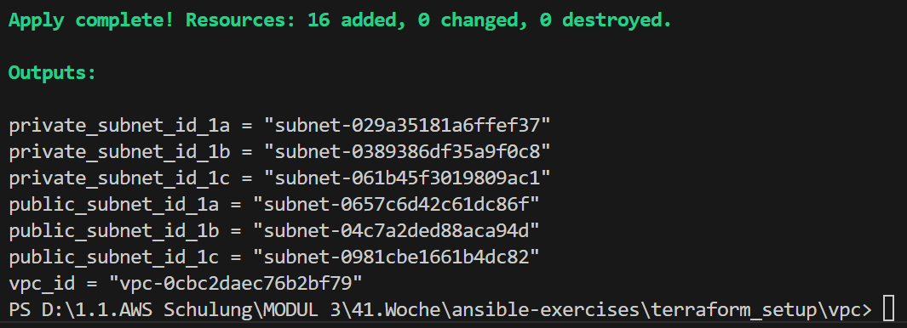
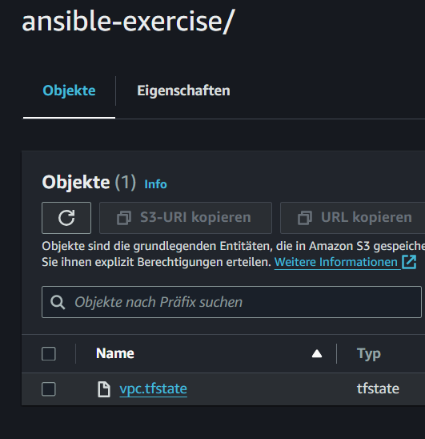
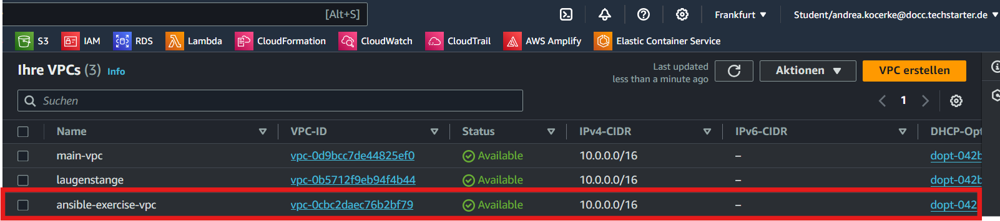

# VPC

Erstellt ein VPC mit 1x Public- und 1x Private-Subnet in jeweils 3 AZs.
Die .tfstate wird in einem Bucket gespeichert. 

# How to configure:
Den Bucket-Namen in der backend.tf selbst eintragen.

```
terraform {
  backend "s3" {
    bucket = "<bucket-name>" # Hier eigenen Bucket eintragen
    key    = "ansible-exercise/vpc.tfstate"
    region = "eu-central-1"
  }
}
```
---
# CHECK ✅






